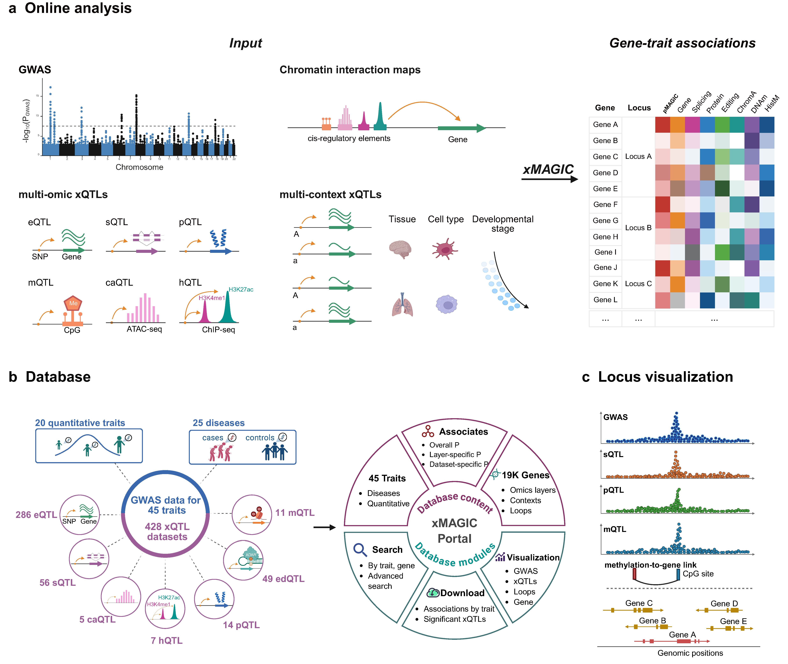

# xMAGIC

xMAGIC is a scalable method designed to integrate a large number of multi-omic xQTL datasets across diverse biological contexts with genome-wide association studies (GWAS) summary statistics. By linking epigenetic marks to target genes using multiple complementary approaches (e.g., chromatin interaction maps, pleiotropy association analysis) and combining association signals from expression and epigenetic phenotypes into a unified gene-trait association test, xMAGIC facilitates the identification of putative effector genes for 75.4% of GWAS loci, as demonstrated in an analysis of 45 human complex traits and 428 xQTL datasets, providing mechanistic insights into genetic associations.



## Installation

You can download the executable binary in [release page](https://github.com/jianyanglab/MAGIC/releases).

```
wget https://github.com/jianyanglab/MAGIC/releases/download/v1.0.2/xmagic-linux
chmod 754 xmagic-linux
```

Verify the installation by running the following command:
```
xmagic-linux --help
```

## Tutorial

xMAGIC integrates GWAS and xQTL summary statistics in a single-step analysis.

We have curated and prepared a variety of publicly available molecular QTL data (downloadable from the yanglab website) and functional element-to-gene maps (downloadable from the yanglab website), which users can use to perform the xMAGIC analysis with their specific complex trait of interest. For illustration purposes, we provide demonstration data that can be used to run xMAGIC analysis with the command line below.

### Example Data

To get started quickly, you can download example data files:

```bash
# Download the complete example dataset
mkdir example_data
cd example_data
wget https://yanglab.westlake.edu.cn/data/magic-portal/example_data/GWAS_data.tar.gz
wget https://yanglab.westlake.edu.cn/data/magic-portal/example_data/e2g_data.tar.gz
wget https://yanglab.westlake.edu.cn/data/magic-portal/example_data/LD_reference.tar.gz
wget https://yanglab.westlake.edu.cn/data/magic-portal/example_data/xQTL_data.tar.gz
for f in *.tar.gz; do tar -xvzf "$f"; done
```

### Running xMAGIC

The basic command to run xMAGIC is:

```
./xmagic-linux --besd-flist example_data/xQTL_data/user_xQTL_list.txt \
	--gwas-summary example_data/GWAS_data/GWAS_T2D_chr11.txt \
	--bfile example_data/LD_reference/ALL_1KGP3_Phase3_mind95_geno95_maf01_hwe1e06_chr \
	--e2g-flist example_data/e2g_data/user_e2g_list.txt \
	--chr 11 \
	--trait-name T2D \
	--out example_data/myxmagic_test
```

### `--besd-flist`

A text file that lists the paths to multiple xQTL BESD datasets (same style as SMR: https://yanglab.westlake.edu.cn/software/smr/#DataManagement).  
You can mix different QTL types, e.g. eQTL, sQTL, pQTL, mQTL, haQTL, caQTL, etc.

**Example**

`example_data/xQTL_data/user_xQTL_list.txt`:

```text
eQTL_DIRECT	example_data/xQTL_data/eQTL_DIRECT_chr	TRUE	gene
eQTL_GTEx_Whole_Blood	example_data/xQTL_data/eQTL_GTEx_Whole_Blood_chr	TRUE	gene
pQTL_FENLAND	example_data/xQTL_data/pQTL_FENLAND_chr	TRUE	gene
mQTL_BrainMeta	example_data/xQTL_data/mQTL_BrainMeta_chr	TRUE	epigenetic
hQTL_H3K4me1_BLUEPRINT	example_data/xQTL_data/hQTL_H3K4me1_BLUEPRINT_chr	TRUE	epigenetic
caQTL_Blood	example_data/xQTL_data/caQTL_Blood_chr	TRUE	epigenetic
```
**Columns** are:

1. **QTL name** — for expression QTLs, use the prefix `eQTL_*`; for splicing QTLs, use `sQTL_*`, etc.
2. **Path** — path to the BESD-formatted QTL file. 
	It is recommended to use **absolute paths** to avoid issues when running the program from different working directories.
3. **Chromosome split flag** — `TRUE` if the QTL files are split by chromosome, `FALSE` otherwise.
4. **QTL type** — either `gene` or `epigenetic`. For entries marked as `epigenetic`, a probe-to-gene link file is required so that signals can be mapped to target genes, please see the `--e2g-flist` flag.

### `--gwas-summary` 

GWAS summary statistics file (format similar to GCTA-COJO: https://yanglab.westlake.edu.cn/software/gcta/#COJO).

### `--bfile`

PLINK binary files (.bed, .bim, .fam) for LD reference.


### `--e2g-flist`

A text file listing paths to multiple functional element-to-gene mapping files. Each mapping file should be tab-delimited with at least four columns: the first three for the element coordinates (chromosome, start position, end position) and the fourth for the gene name. An optional fifth column can specify association strength, and an optional sixth column can specify context. Example file list (mye2g.list):


**Example**

`example_data/e2g_data/user_e2g_list.txt`

```text
ABC	example_data/e2g_data/ABC_chr11.bed
EpiMap	example_data/e2g_data/EpiMap_chr11.bed
RoadMap	example_data/e2g_data/RoadMap_chr11.bed
PCHiC	example_data/e2g_data/PCHiC_chr11.bed
Promoter	example_data/e2g_data/Promoter_chr11.bed
closestTSS	example_data/e2g_data/closestTSS_chr11.bed
```

**Columns** are:

1. **epigenetic link name** — the enhancer-promoter interaction resource name `ABC`, etc.
2. **Path** — path to the enhancer-promoter interaction file.
	It is recommended to use **absolute paths** to avoid issues when running the program from different working directories.

Example mapping file `example_data/e2g_data/ABC_chr11.bed`:
```text
chr11	100438339	100438739	PGR	0.0258146262233206	A Cardiomyocyte
chr11	100438339	100438739	PGR	0.0271777153527535	A Cardiomyocyte
chr11	100439170	100439570	PGR	0.0192453725099139	A Cardiomyocyte
chr11	100439170	100439570	PGR	0.0202615854828699	A Cardiomyocyte
chr11	100445172	100445572	CNTN5	0.0335977399341998	A Cardiomyocyte
chr11	100445172	100445572	CNTN5	0.0340138578504139	A Cardiomyocyte
chr11	100472725	100473125	BIRC2	0.0188125575399639	A Cardiomyocyte
chr11	100472725	100473125	BIRC2	0.0185803409452074	A Cardiomyocyte
chr11	100576412	100576812	CNTN5	0.0194293770614472	A Cardiomyocyte
chr11	100576412	100576812	CNTN5	0.0196700156255881	A Cardiomyocyte
```

If you don’t have an epigenetic–gene interaction annotation file, we provide a set of reference epigenetic link files. These include the enhancer–promoter interactions from ABC, Roadmap, EpiMap, PCHiC, Promoter/Exon, and Closest TSS that were used in the xMAGIC paper.
```
wget https://yanglab.westlake.edu.cn/data/magic-portal/example_data/epimark_to_gene_links.tar.gz
tar -xvzf epimark_to_gene_links.tar.gz
```

### `--out`

Prefix for output files (`example_data/myxmagic_test`), including gene-trait association p-values. 

Example Output `example_data/myxmagic_test_20251105_155430/MAGIC/summary/T2D_MAGIC.txt`:

```
chr	start	end	strand	gene_id	gene_name	GWAS_LOCUS	Lead_SNP	Lead_SNP_BP	MAGIC	eMAGIC	sMAGIC	pMAGIC	edMAGIC	mMAGIC	hMAGIC	caMAGIC	eMAGIC_QTL_name	sMAGIC_QTL_name	pMAGIC_QTL_name	edMAGIC_QTL_name	mMAGIC_QTL_name	hMAGIC_QTL_name	caMAGIC_QTL_name	eMAGIC_probeID	sMAGIC_probeID	pMAGIC_probeID	edMAGIC_probeID	mMAGIC_probeID	hMAGIC_probeID	caMAGIC_probeID
11	16613132	16758340	+	ENSG00000110696	C11orf58	chr11:16388025:18388025	rs5219	17388025	0.00512866875067353	0.00763007269639537	NA	NA	NA	0.00386236898797709	NA	NA	eQTL_DIRECT	NA	NA	NA	mQTL_BrainMeta	NA	NA	ENSG00000110696	NA	NA	NA	cg17284609	NA	NA
11	16777297	17014414	-	ENSG00000166689	PLEKHA7	chr11:16388025:18388025	rs5219	17388025	7.55413644832892e-05	0.000149159376880648	NA	0.00554274494147966	NA	1.78113700000093e-05	0.9214682	0.000315176199999989	eQTL_DIRECT	NA	pQTL_FENLAND	NA	mQTL_BrainMeta	hQTL_H3K4me1_BLUEPRINT	caQTL_Blood	ENSG00000166689	NA	X12731_12_PLEKHA7	NA	cg02095290	11:16932882:16934884	197402
11	17074388	17077715	-	ENSG00000110700	RPS13	chr11:16388025:18388025	rs5219	17388025	0.058802868840196	0.058802868840196	NA	NA	NA	NA	NA	NA	eQTL_GTEx_Whole_Blood	NA	NA	NA	NA	NA	NA	ENSG00000110700.6	NA	NA	NA	NA	NA	NA
11	17077730	17207986	-	ENSG00000011405	PIK3C2A	chr11:16388025:18388025	rs5219	17388025	1.44278256009045e-10	1.44278256009045e-10	NA	NA	NA	NA	NA	NA	eQTL_DIRECT	NA	NA	NA	NA	NA	NA	ENSG00000011405	NA	NA	NA	NA	NA	NA
11	17208153	17349980	+	ENSG00000070081	NUCB2	chr11:16388025:18388025	rs5219	17388025	1.60460533749074e-12	1.60460533749074e-12	NA	NA	NA	NA	NA	NA	eQTL_DIRECT	NA	NA	NA	NA	NA	NA	ENSG00000070081	NA	NA	NA	NA	NA	NA
11	17351800	17377341	+	ENSG00000188211	NCR3LG1	chr11:16388025:18388025	rs5219	17388025	9.42890210353653e-12	0.1771537	NA	NA	NA	4.71445105176826e-12	NA	NA	eQTL_DIRECT	NA	NA	NA	mQTL_BrainMeta	NA	NA	ENSG00000188211	NA	NA	NA	cg16820186	NA	NA
11	17365172	17389331	-	ENSG00000187486	KCNJ11	chr11:16388025:18388025	rs5219	17388025	3.01144472537199e-24	4.04787314778332e-13	NA	NA	NA	1.5057223626916e-24	NA	NA	eQTL_DIRECT	NA	NA	NA	mQTL_BrainMeta	NA	NA	ENSG00000187486	NA	NA	NA	cg15432903	NA	NA
11	17392498	17476894	-	ENSG00000006071	ABCC8	chr11:16388025:18388025	rs5219	17388025	0.967843892880911	NA	NA	NA	NA	0.967843892880911	NA	NA	NA	NA	NA	NA	mQTL_BrainMeta	NA	NA	NA	NA	NA	NA	cg26105227	NA	NA
11	17493895	17544416	-	ENSG00000006611	USH1C	chr11:16388025:18388025	rs5219	17388025	0.464564995136756	NA	NA	NA	NA	0.464564995136756	NA	NA	NA	NA	NA	NA	mQTL_BrainMeta	NA	NA	NA	NA	NA	NA	cg14425863	NA	NA
11	17547259	17647150	+	ENSG00000188162	OTOG	chr11:16388025:18388025	rs5219	17388025	0.872053797891558	NA	NA	NA	NA	0.872053797891558	NA	NA	NA	NA	NA	NA	mQTL_BrainMeta	NA	NA	NA	NA	NA	NA	cg17099016	NA	NA
11	17719571	17722136	+	ENSG00000129152	MYOD1	chr11:16388025:18388025	rs5219	17388025	0.03065185	NA	NA	NA	NA	0.03065185	NA	NA	NA	NA	NA	NA	mQTL_BrainMeta	NA	NA	NA	NA	NA	NA	cg01144436	NA	NA
11	17734774	17856804	+	ENSG00000129159	KCNC1	chr11:16388025:18388025	rs5219	17388025	0.0194788299999999	NA	NA	NA	NA	0.0194788299999999	NA	NA	NA	NA	NA	NA	mQTL_BrainMeta	NA	NA	NA	NA	NA	NA	cg19244655	NA	NA
11	17788048	18013047	-	ENSG00000129158	SERGEF	chr11:16388025:18388025	rs5219	17388025	0.0792508312751415	0.0492783969930815	NA	NA	NA	0.0937100832877356	NA	0.1418364	eQTL_DIRECT	NA	NA	NA	mQTL_BrainMeta	NA	caQTL_Blood	ENSG00000129158	NA	NA	NA	cg23625312	NA	197481
11	18017555	18046269	-	ENSG00000129167	TPH1	chr11:16388025:18388025	rs5219	17388025	0.0435363618627685	0.0435363618627685	NA	NA	NA	NA	NA	NA	eQTL_DIRECT	NA	NA	NA	NA	NA	NA	ENSG00000129167	NA	NA	NA	NA	NA	NA
11	18069935	18106087	-	ENSG00000166788	SAAL1	chr11:16388025:18388025	rs5219	17388025	0.0247461308158468	0.0243330464849628	NA	NA	NA	0.02561576	NA	NA	eQTL_DIRECT	NA	NA	NA	mQTL_BrainMeta	NA	NA	ENSG00000166788	NA	NA	NA	cg12377368	NA	NA
11	18120955	18138488	+	ENSG00000179826	MRGPRX3	chr11:16388025:18388025	rs5219	17388025	NA	NA	NA	NA	NA	NA	NA	NA	NA	NA	NA	NA	NA	NA	NA	NA	NA	NA	NA	NA	NA	NA
11	18172837	18174280	+	ENSG00000179817	MRGPRX4	chr11:16388025:18388025	rs5219	17388025	0.177807000911694	NA	NA	NA	NA	0.177807000911694	NA	NA	NA	NA	NA	NA	mQTL_BrainMeta	NA	NA	NA	NA	NA	NA	cg02608124	NA	NA
11	18231355	18236802	-	ENSG00000148965	SAA4	chr11:16388025:18388025	rs5219	17388025	0.462144826207657	NA	NA	0.462144826207657	NA	NA	NA	NA	NA	NA	pQTL_FENLAND	NA	NA	NA	NA	NA	NA	X15516_12_SAA4	NA	NA	NA	NA
11	18231423	18248635	-	ENSG00000255071	SAA2-SAA4	chr11:16388025:18388025	rs5219	17388025	NA	NA	NA	NA	NA	NA	NA	NA	NA	NA	NA	NA	NA	NA	NA	NA	NA	NA	NA	NA	NA	NA
11	18239223	18248668	-	ENSG00000134339	SAA2	chr11:16388025:18388025	rs5219	17388025	0.0571837028787258	NA	NA	0.0571837028787258	NA	NA	NA	NA	NA	NA	pQTL_FENLAND	NA	NA	NA	NA	NA	NA	X18832_65_SAA2	NA	NA	NA	NA
11	18266260	18269977	+	ENSG00000173432	SAA1	chr11:16388025:18388025	rs5219	17388025	0.110115525667891	NA	NA	0.0545737222970077	NA	0.5709017	NA	NA	NA	NA	pQTL_FENLAND	NA	mQTL_BrainMeta	NA	NA	NA	NA	X15515_2_SAA1	NA	cg24015472	NA	NA
11	18278668	18322198	-	ENSG00000110756	HPS5	chr11:16388025:18388025	rs5219	17388025	0.0422314189381126	0.0422314189381126	NA	NA	NA	NA	NA	NA	eQTL_GTEx_Whole_Blood	NA	NA	NA	NA	NA	NA	ENSG00000110756.17	NA	NA	NA	NA	NA	NA
11	18322295	18367045	+	ENSG00000110768	GTF2H1	chr11:16388025:18388025	rs5219	17388025	0.407604333637021	0.407604333637021	NA	NA	NA	NA	NA	NA	eQTL_GTEx_Whole_Blood	NA	NA	NA	NA	NA	NA	ENSG00000110768.11	NA	NA	NA	NA	NA	NA
```

Columns include chromosome, start/end positions, strand, gene ID, gene symbol, GWAS locus region, overall xMAGIC p-value, and layer-specific p-values for eMAGIC, sMAGIC, pMAGIC, edMAGIC, mMAGIC, hMAIGIC, caMAGIC (eQTL, sQTL, pQTL, edQTL, caQTL, mQTL, hQTL), with NA indicating unavailable data, as well as the most significant QTL name and probeID for each omics layer.


## Data Management

xMAGIC shares data formats with SMR. For full options, see [SMR documentation](https://yanglab.westlake.edu.cn/software/smr/). Curated xQTL datasets (428 total) and the functional element-to-gene maps can be downloaded from the yanglab website.

## Online analysis
An online platform for xMAGIC is available at xMAGIC Portal (http://yanglab.westlake.edu.cn/xMAGIC), which requires only the upload of GWAS summary statistics (try `example_data/GWAS_data/GWAS_T2D_chr11.txt`).

## Citation
Qi T, Guo Y, Chen C, Xu T, Luo J, Jiang Z, Chen H, Guo M, Wang K, Hou J, Yang J. (2025). Integrative analysis of hundreds of multi-omic and cross-context xQTL datasets links over three-quarters of GWAS loci to putative effector genes. Under Review.


## Contact
Ting Qi (ting.qi@sinh.ac.cn) or Jian Yang (jian.yang@westlake.edu.cn).
